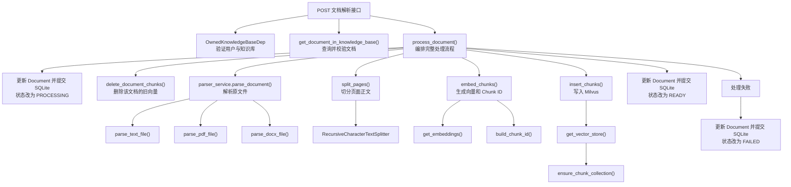
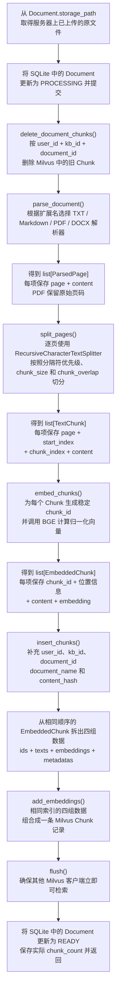

# 阶段三：解析、切分、Embedding 与 Milvus 入库

## 1. 阶段目标与当前进度

本阶段负责把阶段二保存的原文件转换为可以检索的 Milvus Chunk，并通过文档状态明确区分上传、处理中、完成和失败。

完整数据流：

```text
Document(UPLOADED)
→ 解析原文件
→ ParsedPage
→ LangChain 切分
→ TextChunk
→ BGE Embedding
→ EmbeddedChunk
→ Milvus
→ Document(READY)
```

当前进度：

- [x] 解析 TXT 和 Markdown。
- [x] 按真实页码解析普通 PDF。
- [x] 解析 DOCX 普通段落。
- [x] 根据扩展名选择解析器。
- [x] 统一处理文件缺失、类型不支持、解析失败和无有效正文。
- [x] 使用 `RecursiveCharacterTextSplitter` 逐页切分。
- [x] 保存 `page`、`start_index`、`chunk_index` 和正文。
- [x] 根据文档、位置和正文生成稳定的 `chunk_id`。
- [x] 使用本地 BGE 批量生成归一化的 512 维向量。
- [x] 创建固定 Schema 的 Milvus Collection。
- [x] 创建 `AUTOINDEX + COSINE` 向量索引。
- [x] 使用 `langchain-milvus` 批量写入 Chunk。
- [x] 按文档范围精确删除旧 Chunk。
- [x] 实现文档查询和归属校验。
- [x] 编排完整文档处理流程。
- [x] 实现文档解析接口。
- [x] 验证重复解析不会累积 Chunk。

## 2. 本阶段需要实现的 HTTP 接口

```text
POST /knowledge-bases/{kb_id}/documents/{document_id}/parse
```

接口用途：

- 验证当前用户有权访问知识库和文档。
- 将文档状态改为 `PROCESSING`。
- 删除该文档在 Milvus 中的旧 Chunk。
- 解析、切分并生成 Embedding。
- 把新 Chunk 写入 Milvus。
- 成功后更新为 `READY` 并记录 `chunk_count`。
- 失败后更新为 `FAILED` 并记录安全错误摘要。

接口不接收客户端指定的 `user_id`、`kb_id` 或文件路径。它们必须来自已验证的用户、知识库和 SQLite 文档记录。

## 3. 接口函数层级关系



### 3.1 从原文件到 Milvus 的纵向流程图

这张图按照手写笔记的方式，重点展示每一步的输入、处理动作和输出数据结构：



其中一条 Milvus 记录的对应关系是：

```text
ids[i]         -> chunk_id 主键
texts[i]       -> content 正文
embeddings[i]  -> embedding 向量
metadatas[i]   -> 用户、知识库、文档、页码和位置等字段

四组数据中相同的索引 i，共同组成第 i 条 Milvus 记录。
```

## 4. 各层函数职责

### 4.1 路由层

#### `parse_document_endpoint()`

负责：

- 接收路径中的 `kb_id` 和 `document_id`。
- 获取数据库 Session。
- 使用依赖完成用户、知识库和文档校验。
- 调用 `process_document()`。
- 返回更新后的 `DocumentRead`。

不负责解析、切分、Embedding、直接操作 Milvus 或拼接底层异常。

### 4.2 权限与查询层

#### `get_owned_knowledge_base()`

已有函数，负责：

```text
X-User-ID
→ 查询当前用户
→ 查询知识库
→ 比较 owner_id
→ 返回当前用户拥有的 KnowledgeBase
```

#### `get_document_in_knowledge_base()`

已经实现，负责：

```text
根据 document_id 查询 Document
→ 文档不存在：404
→ document.kb_id 与当前知识库不一致：404
→ 返回 Document
```

归属不一致时使用 404，避免向当前用户泄露其他知识库是否存在该文档 ID。

### 4.3 业务编排层

#### `process_document()`

负责按固定顺序协调下层函数：

```text
检查文档状态
→ PROCESSING
→ 删除旧向量
→ 解析
→ 切分
→ Embedding
→ Milvus 写入
→ READY
```

发生异常时：

```text
回滚当前 SQLite 事务
→ Document 更新为 FAILED
→ 保存安全错误摘要
→ 重新抛出业务异常
```

如果 Milvus 写入中途失败，下一次重新解析仍会先按 `document_id` 删除可能残留的 Chunk。

该函数负责流程和状态，不重复实现具体解析、切分和向量算法。

### 4.4 文档状态代码块

开始处理时：

```text
status = PROCESSING
error_message = None
提交 SQLite
```

成功写入并 `flush()` 后：

```text
status = READY
chunk_count = Milvus 实际写入数量
error_message = None
提交 SQLite
```

捕获异常后：

```text
status = FAILED
chunk_count = 0
error_message = 安全错误摘要
提交 SQLite
```

### 4.5 Milvus 精确删除层

#### `delete_document_chunks()`

使用 `pymilvus.MilvusClient` 按三个字段共同过滤：

```text
user_id + kb_id + document_id
```

用途：

- 重新解析前删除旧 Chunk。
- 下一次重试时清理上次可能残留的部分写入。
- 防止 Chunk 数量从 2 累积成 4。
- 防止误删其他用户、知识库或文档的数据。

该函数只删除 Milvus Chunk，不删除 SQLite 的 `Document` 和原文件。

### 4.6 文档解析层

#### `parser_service.parse_document()`

负责：

```text
检查原文件
→ 根据扩展名选择解析器
→ 转换解析异常
→ 检查有效正文
→ 返回 list[ParsedPage]
```

具体解析器：

- `parse_text_file()`：TXT 和 Markdown，统一逻辑页码为 1。
- `parse_pdf_file()`：普通 PDF，每个原始页面对应一个 `ParsedPage`。
- `parse_docx_file()`：DOCX 普通段落，第一版统一逻辑页码为 1。

### 4.7 文本切分层

#### `split_pages()`

负责把 `ParsedPage` 转换成 `TextChunk`，保存：

- `page`：原始页码。
- `start_index`：Chunk 在当前页正文中的起始位置。
- `chunk_index`：Chunk 在整个文档中的连续顺序。
- `content`：切分后的正文。

中文分隔符优先级：

```text
段落空行
→ 换行
→ 句号
→ 感叹号
→ 问号
→ 分号
→ 逗号
→ 空格
→ 字符强制切分
```

### 4.8 Chunk ID 与 Embedding 层

#### `build_chunk_id()`

使用以下稳定输入生成 SHA-256：

```text
document_id | page | start_index | content
```

相同输入生成相同 ID；文档、位置或正文发生变化时 ID 改变。

#### `embed_chunks()`

负责：

```text
TextChunk 正文列表
→ BGE embed_documents()
→ 校验向量数量
→ 校验每个向量为 512 维
→ build_chunk_id()
→ EmbeddedChunk
```

本地 BGE 已验证：

```text
维度 = 512
向量模长 = 1.0
```

### 4.9 Milvus Collection 与写入层

#### `ensure_chunk_collection()`

负责幂等创建：

```text
mini_rag_handwrite_chunks
```

已验证：

```text
字段数量 = 11
向量维度 = 512
索引类型 = AUTOINDEX
相似度 = COSINE
索引状态 = Finished
```

#### `get_vector_store()`

负责创建并缓存 `langchain-milvus.Milvus` 包装器，映射自定义字段：

```text
primary_field = chunk_id
text_field = content
vector_field = embedding
```

#### `insert_chunks()`

负责把 `EmbeddedChunk` 拆成顺序一致的四组数据：

```text
ids
texts
embeddings
metadatas
```

metadata 保存：

- `user_id`
- `kb_id`
- `document_id`
- `document_name`
- `page`
- `start_index`
- `chunk_index`
- `content_hash`

真实 Milvus 写入、查询和清理测试已经通过。

## 5. SQLite 与 Milvus 的状态关系

```text
SQLite Document.status
→ 表示业务处理状态

Milvus Chunk
→ 表示可以参与向量检索的数据
```

两者没有跨数据库事务，因此失败状态和重试清理必须保持可解释：

```text
Milvus 写入失败
→ SQLite 标记 FAILED
→ 下一次重新解析先按 document_id 删除可能残留的 Chunk
```

重新解析必须先按 `document_id` 删除旧 Chunk，而不能根据新正文重新计算旧 `chunk_id`，因为切分参数或正文变化后旧 ID 可能无法重新得到。

## 6. 已完成的实现顺序

```text
1. delete_document_chunks()
2. get_document_in_knowledge_base()
3. process_document()
4. POST /knowledge-bases/{kb_id}/documents/{document_id}/parse
5. 接口异常和状态测试
6. 重复解析不累积验收
```

## 7. 接口验收场景

### 正常解析

```text
UPLOADED
→ PROCESSING
→ READY
→ chunk_count 等于 Milvus 实际 Chunk 数
```

### 重复解析

```text
第一次解析：2 个 Chunk
第二次解析：仍为 2 个 Chunk
不能累积成 4 个
```

### 正在处理

```text
Document.status = PROCESSING
→ 再次请求返回 409
→ 不重复执行
```

### 解析失败

```text
损坏 PDF、文件丢失或 Embedding 失败
→ status = FAILED
→ chunk_count = 0
→ error_message 保存安全摘要
→ 下一次重新解析先清理该文档可能残留的 Chunk
```

### 用户隔离

```text
其他用户请求相同 kb_id 或 document_id
→ 403 或 404
→ 不执行解析、删除或写入
```

## 8. 本阶段完成标准

- 能讲清“上传完成”和“向量化完成”为什么是两个状态。
- 能讲清原文件、`ParsedPage`、`TextChunk`、`EmbeddedChunk` 和 Milvus Entity 的关系。
- 能说明 `page`、`start_index`、`chunk_index` 和 `chunk_id` 各自作用。
- 能说明为什么重解析前必须按 `document_id` 删除旧 Chunk。
- 同一文档重复解析不会累积 Chunk。
- 失败后 SQLite 状态和 Milvus 数据保持可解释、可重试。
