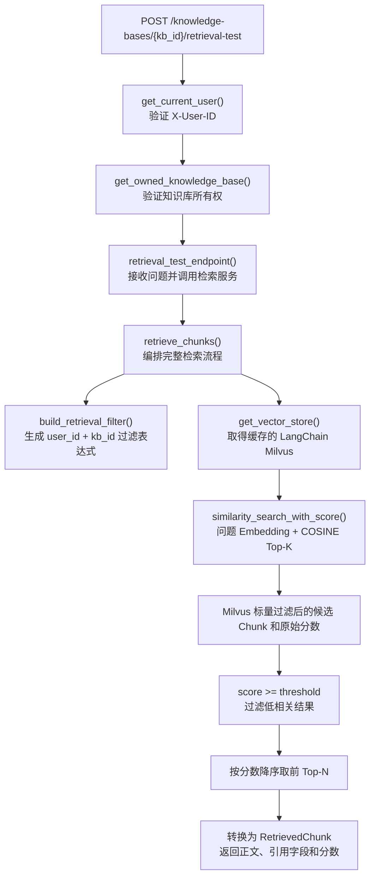

# 阶段四：检索分数、阈值与知识库过滤

## 1. 阶段目标

本阶段只验证检索，不调用 DeepSeek。目标是把用户问题转换为向量，在当前用户和知识库范围内召回候选 Chunk，并按照相似度阈值与最终数量返回结果。

固定检索参数：

```text
候选 Top-K = 10
相似度阈值 = 0.50
最终 Top-N = 3
距离类型 = COSINE
```

完整流程：

```text
用户问题
→ BGE 生成问题向量
→ Milvus 使用 user_id + kb_id 过滤并执行 COSINE 检索
→ 返回最多 10 个候选
→ 保留 score >= 0.50 的 Chunk
→ 按分数从高到低最多返回 3 个
```

`user_id + kb_id` 必须直接放进 Milvus 的搜索表达式。这样其他用户的数据不会进入当前请求的候选结果，也不会占用 Top-K 名额。

## 2. 需要实现的 HTTP 接口

```text
POST /knowledge-bases/{kb_id}/retrieval-test
```

请求头：

```text
X-User-ID: 当前用户 UUID
```

请求体：

```json
{
  "question": "北京出差住宿每晚最高可以报销多少？"
}
```

响应示例：

```json
{
  "question": "北京出差住宿每晚最高可以报销多少？",
  "results": [
    {
      "chunk_id": "64位SHA-256",
      "document_id": "文档UUID",
      "document_name": "travel_policy.pdf",
      "page": 1,
      "content": "北京出差住宿含税上限……",
      "score": 0.73
    }
  ]
}
```

没有 Chunk 达到阈值时：

```json
{
  "question": "员工购买个人健身卡能报销多少？",
  "results": []
}
```

不能为了补满 Top-N 而返回低于阈值的结果。

## 3. 接口函数层级关系



## 4. 各函数职责

### 4.1 `retrieval_test_endpoint()`

负责：

- 接收并校验请求体中的问题。
- 获取已经通过所有权校验的 `KnowledgeBase`。
- 调用 `retrieve_chunks()`。
- 转换并返回检索测试响应。

不负责生成向量、拼接 Milvus 表达式或自行过滤分数。

### 4.2 `build_retrieval_filter()`

输入：

```text
user_id
kb_id
```

输出：

```text
user_id == "..." and kb_id == "..."
```

两个值都来自服务器已验证的数据，不接收客户端直接传入。

### 4.3 `retrieve_chunks()`

负责：

```text
检查检索配置
→ 构造隔离表达式
→ 调用 LangChain Milvus 检索候选 Top-K
→ 读取 Document 正文、metadata 和 COSINE 分数
→ 保留达到阈值的结果
→ 最多返回 Top-N 个 RetrievedChunk
```

### 4.4 `get_vector_store()`

复用阶段三已经创建的 LangChain Milvus 包装器。它内部持有 BGE Embedding，因此调用：

```python
similarity_search_with_score(query=question, ...)
```

时会先执行：

```text
get_embeddings().embed_query(question)
```

然后把问题向量交给 Milvus。

### 4.5 `similarity_search_with_score()`

本项目使用的主要参数：

```text
query = 用户问题
k = 候选 Top-K
expr = user_id + kb_id 标量过滤表达式
param = COSINE 搜索参数
```

返回：

```python
list[tuple[LangChainDocument, float]]
```

其中：

```text
LangChainDocument.page_content = Chunk 正文
LangChainDocument.metadata = Chunk 的主键、归属和引用字段
float = Milvus 返回的 COSINE 分数
```

## 5. 统一检索结果

在 `retrieval_service.py` 中定义：

```python
@dataclass(frozen=True)
class RetrievedChunk:
    chunk_id: str
    document_id: UUID
    document_name: str
    page: int
    content: str
    score: float
```

它把 LangChain 的 `Document + score` 转换成项目自己的稳定结构，避免路由层依赖 LangChain 内部对象。

## 6. 三个检索参数的区别

### 候选 Top-K

控制 Milvus 第一轮最多召回多少个候选：

```text
Top-K = 10
→ 最多让后续阈值判断看到 10 个候选
```

过小可能漏掉相关结果；过大会增加传输和后续处理成本。

### 相似度阈值

控制 Chunk 是否合格：

```text
score >= 0.50：保留
score < 0.50：过滤
```

阈值过低会返回无关内容，过高会让有答案的问题也没有结果。

### 最终 Top-N

控制合格结果最多返回几个：

```text
通过阈值的结果有 7 个
Top-N = 3
→ 最终只返回分数最高的 3 个
```

## 7. 分步实现顺序

### 步骤一：配置和 API Schema

- 在 `Settings` 中加入 Top-K、Top-N 和阈值。
- 在 `.env.example` 中加入对应配置说明。
- 增加检索请求、单个结果和响应 Schema。

### 步骤二：检索服务

- 新建 `app/services/retrieval_service.py`。
- 定义 `RetrievedChunk`。
- 实现隔离表达式。
- 调用 Milvus 检索。
- 实现阈值与 Top-N。

### 步骤三：检索测试接口

- 新建 `app/routers/retrieval.py`。
- 实现 `POST /knowledge-bases/{kb_id}/retrieval-test`。
- 在 `main.py` 注册路由。

### 步骤四：自动化测试

- 等于阈值的结果必须保留。
- 低于阈值的结果必须过滤。
- 返回数量不能超过 Top-N。
- Milvus 表达式必须同时包含 `user_id` 和 `kb_id`。
- Mock 检索失败时返回安全业务错误。

### 步骤五：真实集成验收

- 使用阶段三已经解析的文档测试相关问题。
- 检查返回的原始 COSINE 分数。
- 测试无关问题是否返回空列表。
- 测试其他用户访问知识库返回 403。

## 8. 完成标准

- 能解释候选 Top-K、阈值和最终 Top-N 的不同作用。
- 任何检索都必须带 `user_id + kb_id` 过滤。
- 返回真实 `chunk_id`、文档、页码、正文和分数。
- 无结果时返回空列表，不用低分 Chunk 补足数量。
- 本阶段不调用 DeepSeek。
