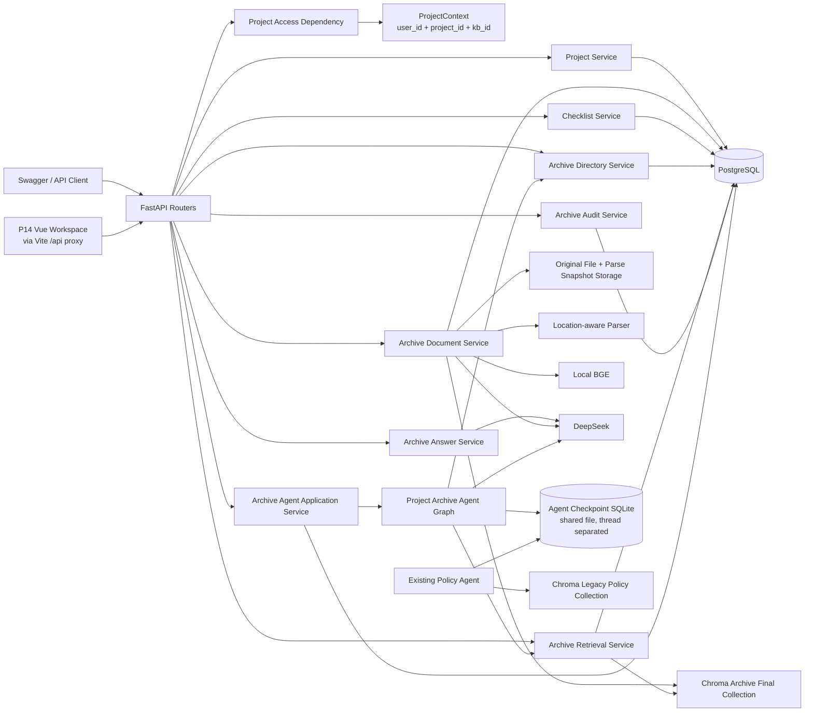
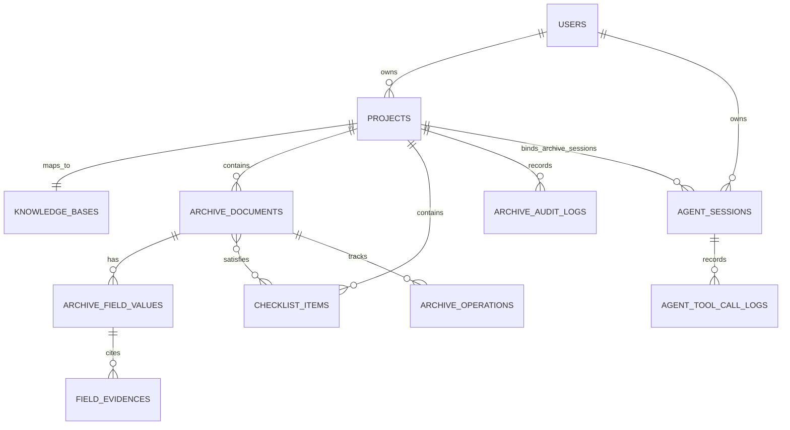
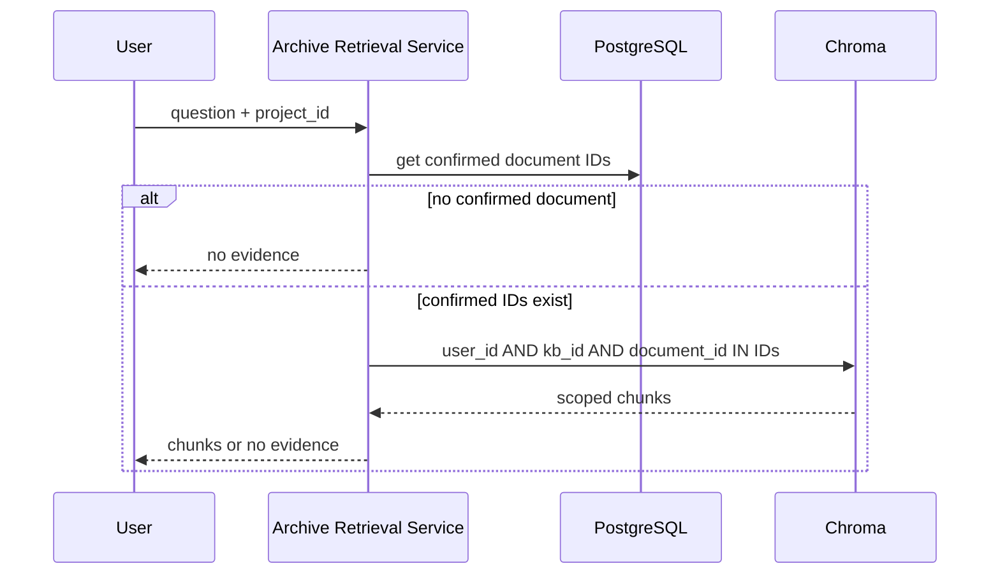
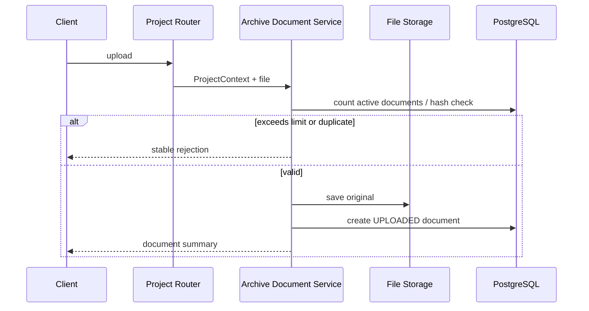
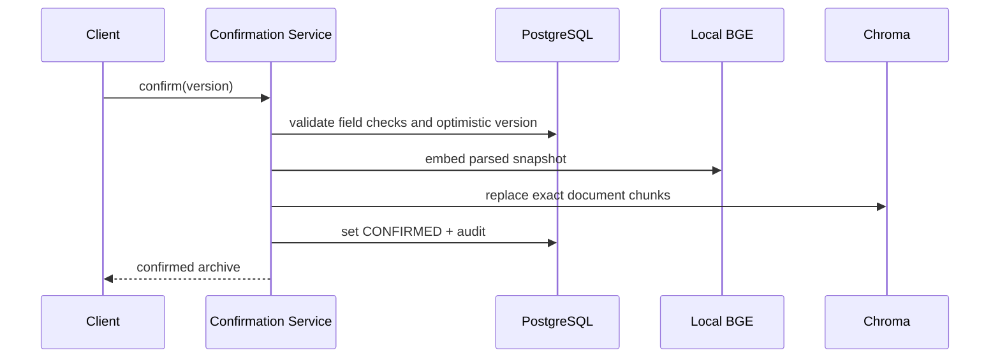
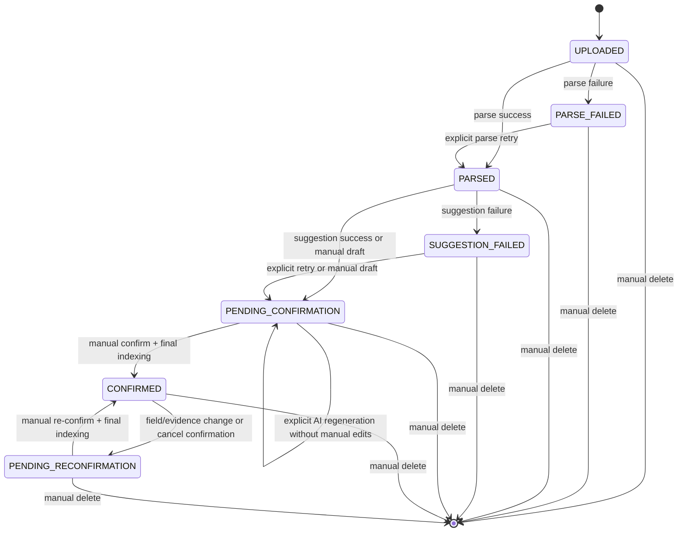

# 智慧档案与企业文档智能 V1 技术架构

## 1. 文档信息

| 项目 | 内容 |
|---|---|
| 对应需求 | `docs/design/需求说明.md` 的 FR-019～FR-042、BR-008～BR-039、NFR-011～NFR-024 |
| 文档状态 | FR-019～FR-041 架构基线已确认并完成既定实现；FR-042 数据库、API 契约与 Implementation Plan 已确认，P00～P07 已通过，下一步为 Swagger、真实固定集与 Vue 验收 |
| 更新日期 | 2026-09-16 |
| 当前业务方向 | 智慧档案与企业文档智能 |
| 架构风格 | 同步 FastAPI 模块化单体 |

本文件描述智慧档案 V1 的架构基线。当前代码已实现项目、清单、上传解析、AI/手工草稿、
确认—INDEX/取消确认、正式目录、清单关联、审计、正式检索、证据问答与物理删除；本地质量和
真实链路的通过范围以 `docs/implementation/验收报告.md` 为准。

当前项目仍保留企业知识库检索 Agent 基座。FR-042 复用其“PostgreSQL 会话归属 + SQLite
Checkpoint 消息状态 + 脱敏工具审计”的机制，使用独立的档案 Graph 与工具集合，并按全局唯一
`thread_id` 复用同一受保护 Checkpoint 文件。SQLite 仍不是档案字段、确认状态、正式可见性或
项目绑定的业务事实来源。

向量存储已由 Milvus 改为 Chroma 单机服务模式，详见
`docs/design/Chroma迁移决策.md`。`infrastructure/chroma.py`、`rag/vector_store.py`、检索、删除、健康检查和 Compose 已完成
本地代码/单测迁移；正式 Collection 空库重建和 768 维 canary 已完成。完整云端应用栈与
2 vCPU / 2 GB 资源验证仍未进行。

## 2. 架构目标与关键决策

### 2.1 目标

架构需要支持以下业务闭环：

```text
项目隔离
→ 上传原文件
→ 解析并保存可追溯文本快照
→ AI 建议或人工录入字段
→ 人工确认正式归档
→ 确认档案与清单项关联
→ 正式目录、缺失提示与带证据问答
→ 在项目绑定的持久化会话中选择目录导航或原文证据工具
```

### 2.2 核心架构决策

1. 采用模块化单体，不引入微服务、Repository 层、多 Agent 或任务队列。
2. 逻辑上的“工程项目”拥有一个唯一知识库范围；客户端以项目为业务入口，
   服务端将其解析为受控的 `ProjectContext`。
3. PostgreSQL 中的档案确认状态是正式范围的唯一事实来源。Chroma 不单独决定
   哪些文档可以被正式检索。
4. 未确认文档不写入正式检索 Collection；正式问答还必须从 PostgreSQL 获取
   `CONFIRMED` 文档集合，再构造 Chroma 的文档范围过滤，形成双重可见性闸门。
5. 解析、AI 建议、确认和删除是显式 API 动作。同步链路保持可观察、可重试。
6. 档案字段、字段证据、清单关联、Agent 会话归属和工具审计保存为 PostgreSQL 业务事实；
   制度 Agent 与项目档案助手复用同一受保护 SQLite Checkpoint 文件，以全局唯一 `thread_id`
   隔离，只保存可序列化消息和 Graph 执行状态。
7. FR-039 继续使用直接的“受控检索 → Grounded Prompt → 回答”服务，不为这个单一检索动作
   额外引入 Tool Calling Agent。FR-042 仅为“目录或证据”的多意图选择提供一个只读 Agent。
8. 项目档案助手不复用制度 Agent 的 Prompt、Graph State 或工具语义；二者只复用 Checkpoint
   生命周期、安全序列化、会话所有权和脱敏审计模式，不引入运行时多 Agent 编排。
9. 档案工具通过运行时注入的 Session 工厂创建短生命周期只读数据库 Session；Graph State 只含
   UUID 字符串、轮次控制字段和消息，不保存 Session、Engine、模型或向量客户端。

第 4 项专门防止“文档处理列表”和“正式档案目录”共用底层数据时，待确认文档
被误曝到正式查询或问答。

## 3. 现有基础、改造边界与缺口

### 3.1 可复用基础

| 现有模块 | 当前职责 | 智慧档案中的处理方式 |
|---|---|---|
| `app/dependencies/auth.py` | 验证 Bearer Access Token 与可撤销会话 | 继续复用 |
| `app/dependencies/resources.py` | 知识库、文档、会话所有权 | 扩展为项目上下文和项目资源校验 |
| `app/services/infrastructure/files.py` | 保存、删除原文件和哈希 | 继续复用并增加 20 MB、100 份上限校验入口 |
| `app/services/rag/parser.py` | PDF/DOCX/TXT/MD 文本提取 | 旧知识库解析；档案解析位于 `archive/parser.py` |
| `app/services/rag/chunks.py` | 分块与稳定 Chunk ID | 旧知识库切分；正式档案使用 `archive/final_chunks.py` |
| `app/services/rag/embeddings.py` | 本地 BGE Embedding | 继续复用 |
| `app/services/infrastructure/chroma.py`、`app/services/rag/vector_store.py` | Chroma 客户端、旧知识库 Collection 写入与删除 | 档案 Final Collection 位于 `archive/final_chunks.py` |
| `app/services/rag/retrieval.py` | 用户/知识库范围检索 | 旧知识库检索；档案范围检索位于 `archive/retrieval.py` |
| `app/services/rag/prompting.py` | 旧知识库聊天的引用、上下文与 Prompt 消息组装 | 不属于 LangGraph Agent 编排 |
| `app/services/infrastructure/ai_models.py` | DeepSeek 与 Embedding 客户端 | 分别服务于建议与 Grounded 问答 |
| `app/agents/admin/runtime.py` 与 `app/services/agent/` | 制度 Agent 的 Checkpoint、会话、消息与审计先例 | 复用机制和安全约束；档案助手使用独立 Graph/投影并复用同一受保护 Checkpoint 文件 |
| `app/services/archive/catalog.py` | 正式档案目录、筛选与删除阻断 | 作为目录工具的唯一业务查询入口，再投影为五字段工具 DTO |
| `app/services/archive/retrieval.py`、`questions.py` | 正式证据双重闸门、Top-8、D5/D6 判定和引用映射 | 证据工具复用检索；最终回答复用结构化判定及 FR-039 的文件/位置/摘录字段定义 |
| `app/core/errors.py`、日志 | 稳定错误和服务端日志 | 继续复用 |
| Alembic/PostgreSQL | 业务迁移与事实存储 | 新增档案领域迁移 |

### 3.2 必须改造

| 当前行为 | 为什么不足 | 目标改造 |
|---|---|---|
| `DocumentStatus` 使用 `PROCESSING/READY/FAILED` | 无法表达建议、人工检查、确认和重新确认 | 以需求中的七个用户可见状态替换，并分离内部操作状态 |
| `process_document()` 当前解析后立即 Embedding 并写入旧 Milvus | `READY` 文档会参与现有检索，违反未确认不可问答 | 解析只生成文本快照；确认时才建立正式 Chroma 检索索引 |
| DOCX 被拼成一个逻辑页 | 无法提供稳定段落证据 | 生成段落序号、摘录和规范化定位辅助信息 |
| TXT/MD 使用逻辑页 1 | 无法提供行号范围 | 生成从 1 开始的行号范围 |
| 检索只过滤 `user_id + kb_id` | 未确认或孤立向量可能被检索 | 再过滤 PostgreSQL 已确认 `document_id` 集合 |
| `GET /documents` 直接返回全部文档 | 易与正式档案目录混淆 | 分离处理列表查询服务和正式目录查询服务 |

### 3.3 新增领域能力

- 项目与知识库的一对一业务映射。
- 档案字段、字段状态、来源、证据和修改摘要。
- 解析快照、`file_hash`、`snapshot_hash` 与解析器版本。
- 演示清单、档案—清单项确认关联和缺失计算。
- 正式目录查询、档案详情、正式问答。
- 项目绑定的持久化档案助手会话、两个只读工具和脱敏工具审计。
- 领域审计、并发版本和内部操作记录。

### 3.4 不适合照搬

- `search_company_policy`：语义绑定公司制度，不适合项目档案问答。
- 制度 Agent 的 Prompt、Graph 与 `search_company_policy`：不能改名后当作档案助手；档案助手只
  复用 Checkpoint 机制，仍不能在其中保存档案确认、字段、清单或项目归属事实。
- 已删除的请假领域、人工决定接口和写工具：不能改名后复用。
- 当前“解析即入旧 Milvus”的文档链路：不能作为正式档案索引的可见性规则。

### 3.5 当前验证边界

- 已有自动测试、离线迁移 SQL 和有限真实检索记录只证明旧知识库/制度检索基座的
  部分行为，不能替代智慧档案 V1 的实现与质量验收。
- 真实 PostgreSQL 空库迁移、完整 Docker Compose 启动和健康检查仍需在可用运行环境
  中复验。
- 持久化的 BGE 模型路径仍需在实际配置修改后复验；在完成前不得宣称新架构已可
  通过默认配置端到端运行。

## 4. 分层与目标模块

调用方向保持不变：

```text
Router → Project Access / Application Service → Domain Service
→ PostgreSQL、文件系统、Chroma、DeepSeek
```

Router 不直接提交业务事务、查询 Chroma 或调用模型。Domain/Service 不返回
FastAPI 响应对象。Graph State 不保存数据库 Session、模型客户端或向量客户端。

以下目录说明当前职责边界。`projects.py` Router 保持单一项目入口，不拆出额外的档案
Router；services 按六个业务域组织，现有通用能力已归入对应子包，不新增 Repository：

```text
app/
├── routers/
│   └── projects.py                 # 项目、档案生命周期、目录、检索与审计入口
├── dependencies/
│   └── project_context.py          # ProjectContext 与所有权校验
├── services/
│   ├── archive/                    # 智慧档案上传、解析、确认、索引、目录与问答
│   ├── project/                    # 项目与清单管理
│   ├── rag/                        # 旧知识库文档、切分、向量与聊天
│   ├── agent/                      # Agent 会话、Checkpoint 消息、审计与执行
│   ├── identity/                   # 身份认证
│   └── infrastructure/             # 文件、模型与 Chroma 客户端
├── models/
│   ├── agent.py                   # 两类受控会话及脱敏工具调用审计
│   ├── project.py
│   ├── archive.py
│   ├── checklist.py
│   └── archive_audit.py
└── schemas/
    ├── archive_agent.py           # FR-042 会话、消息、回答与目录来源契约
    ├── project.py
    ├── archive.py
    ├── checklist.py
    └── archive_audit.py
```

FR-042 在 `app/agents/archive/` 中新增独立的 `state.py`、`prompts.py`、`graph.py` 和
`runtime.py`，工具适配器位于 `app/agents/tools/archive_tools.py`；项目级会话、消息、执行和
删除协调仍放在 `app/services/agent/` 下的档案专用模块。除非实现中出现真实重复，不为两个 Graph
提前抽象通用基类，也不改变制度 Agent 对外行为。

文件、解析、切分、Embedding、模型、向量和 Chroma 客户端等通用能力已归入上述对应
子包。不得仅为模仿其他项目新增空转 Repository 层。

## 5. 总体组件图



FR-042 不依赖 `LegacyAgent` 的 Graph 或工具，但复用同一受保护 Agent Checkpoint SQLite 文件，
以全局唯一 `thread_id` 保存并隔离可恢复会话状态。P14 的 Vue 工作台只能经由
FastAPI 调用；它不连接 PostgreSQL、Chroma、文件系统、本地 BGE 或 DeepSeek，也不提交
`user_id`、`owner_id`、`kb_id` 等授权字段。

## 6. 项目访问与授权边界

### 6.0 身份认证边界（AV1-A01）

公开注册、登录和刷新位于 `/auth`，注销使用当前会话的 Bearer Access Token。密码在
`app/services/identity/authentication.py` 中使用 Argon2 哈希；JWT 编解码与 Token 用途校验位于 `core/security`。Router
不直接读取密码哈希或签名密钥；未配置有效 `AUTH_JWT_SECRET` 时安全拒绝签发或验证 Token，
不回退到内置默认密钥。

受保护请求先由 `CurrentUserDep` 验证 Bearer Access Token 的签名、用途、过期时间和关联会话，
再将数据库中的用户注入项目、知识库、聊天和 Agent 所有权依赖。Refresh Token 仅可调用刷新接口；
刷新只签发新的 Access Token，不轮换 Refresh Token；注销将对应 `auth_sessions` 记录标记为撤销。
`X-User-ID` 不再构成身份后门。

### 6.1 ProjectContext

每个项目级请求先执行以下动作：

```text
Bearer Access Token
→ 验证签名、用途、到期时间与未撤销会话
→ 查询真实 User
→ 查询 Project
→ 校验 Project.owner_id == current_user.id
→ 获取 Project 对应 kb_id
→ 注入不可由客户端覆盖的 ProjectContext
```

`ProjectContext` 是内部不可变 dataclass，至少包含：

| 字段 | 用途 |
|---|---|
| `user_id` | PostgreSQL 所有权与 Chroma 元数据过滤 |
| `project_id` | 项目、清单、字段、审计和目录范围 |
| `kb_id` | 复用现有文件、Chunk 与 Chroma 数据隔离范围 |

客户端不提交 `owner_id`、`user_id` 或可替换的 `kb_id`。模型也不能生成这些值。

### 6.2 资源校验

- 项目接口：验证项目所有权。
- 文档、档案字段、清单项、关联和审计接口：先验证项目，再验证资源属于该项目。
- 删除文档与 Chroma 清理：必须带 `user_id + kb_id + document_id`。
- 正式问答：服务端从 `ProjectContext` 注入用户、项目和知识库范围。
- 项目档案助手入口：先解析 `ProjectContext`，再按 `session_id + user_id + project_id + kb_id +
  agent_type=ARCHIVE` 读取 ACTIVE 会话；任一不匹配统一按资源不可用处理。制度 Agent 入口反向要求
  `agent_type=POLICY` 且 `project_id` 为空，不能尝试读取档案 Checkpoint 或工具日志。

## 7. 逻辑数据边界

本节只定义逻辑对象和归属，不定义物理列、索引或迁移细节；后者属于
`docs/design/数据库设计.md`。



`AgentSession` 的 MVP 逻辑边界只扩展 `agent_type` 与可空 `project_id`，继续保留 `user_id`、
`kb_id`、唯一 `thread_id` 和既有时间字段。制度会话要求 `project_id` 为空，档案会话要求
`project_id` 非空且与项目的 `kb_id` 一致。制度存量行迁移为 `POLICY + project_id NULL`；现有
制度接口固定过滤该类型，档案入口固定过滤 `ARCHIVE`。本期不新增会话删除状态、AgentTurn 或
AgentTurnCitation；消息正文继续只存在 SQLite Checkpoint，工具审计继续归属 AgentSession。

### 7.1 Project

Project 是智慧档案的业务入口，拥有项目名称、项目说明、所有者和一个唯一
`kb_id`。项目与现有 `KnowledgeBase` 的物理映射方案由数据库设计决定：

- 可新增 `projects` 并对 `kb_id` 建立唯一一对一映射；
- 或在满足迁移和通用知识库兼容性的前提下扩展现有实体。

无论选哪种物理方案，业务 API 和 `ProjectContext` 都只暴露项目语义。

### 7.2 ArchiveDocument 聚合

ArchiveDocument 以现有 Document 为原文件身份基础，逻辑上包含：

- 原文件元数据、`file_hash`、存储路径和用户可见文档状态；
- 解析快照元数据；
- 七个字段及独立检查状态；
- 字段证据和人工来源标记；
- 确认人、确认时间、修改摘要和并发版本；
- 正式检索索引状态与内部操作记录。

档案目录不创建第二份“正式文档”副本；它是 `CONFIRMED` ArchiveDocument 的
专用查询视图。

### 7.3 ParsedSnapshot

解析成功后保存派生快照，而不是立即写入正式 Chroma：

| 内容 | 用途 |
|---|---|
| `file_hash` | 原始上传文件字节的 SHA-256；只用于当前项目内的重复上传校验 |
| `snapshot_hash` | 位置感知解析快照的规范化内容与定位信息的 SHA-256；用于确认字段证据所依赖的快照未变化 |
| 解析器版本 | 解释定位生成规则 |
| 位置感知片段 | AI 建议、字段证据和确认时 Embedding |
| 摘录辅助定位 | DOCX 段落变化后的人工核验 |

`file_hash` 不用于判断快照内容或证据定位是否变化，`snapshot_hash` 也不参与上传
去重。原文件仍保存在文件系统；快照是可删除、可重新生成的派生文件。删除文档时，
原文件和快照一并删除。`snapshot_hash` 的规范化序列化格式和数据库字段细节在后续
数据库设计中固定。

### 7.4 FieldValue 与 FieldEvidence

每个正式字段独立保存：

- 值或空值；
- 检查状态；
- 来源（AI 或人工）；
- 无原文证据标记；
- 修改人、时间和可选原因。

证据保存当前文档的摘录、定位类型、定位值和必要的规范化辅助文本。AI 非空字段
必须至少关联一条证据；人工字段可以证据为空。

索引的 `evidence_values` 正式模式会额外将已人工确认、且具有当前快照 FieldEvidence 的字段值
注入其定位匹配的 Final Chunk 向量输入；它不改变 Chroma 保存的原文、对外摘录或定位。若字段标记为
无原文证据、证据快照过期、定位不包含或锚点不匹配，则该字段不参与向量上下文。该模式与
bge-base/768 已成为正式默认并通过 D6-B 固定质量门；当前没有冻结独立 Reranker 分数阈值。

### 7.5 ChecklistItem 与 ChecklistLink

ChecklistItem 保存名称、资料类型、必需属性、阶段和说明。ChecklistLink 是
ArchiveDocument 与 ChecklistItem 的多对多关系，单独保存确认状态、确认人、
确认时间与并发版本。

清单项“满足”不是一个可由类型自动推导的持久化事实，而是：

```text
document.status == CONFIRMED
AND checklist_link.status == CONFIRMED
```

缺失/未提供是查询时根据上述条件计算的派生结果。

### 7.6 ArchiveAuditLog 与 ArchiveOperation

- ArchiveAuditLog 保存用户可查询的脱敏业务操作。
- ArchiveOperation 保存内部解析、索引或删除操作状态，用于恢复、避免重复和
  观察跨存储失败。

ArchiveOperation 不属于七种用户可见文档状态，正常文档处理列表不直接展示它。
成功删除后不保留 Document；只保留脱敏删除审计。

内部操作至少区分 `operation_type`（`PARSE`、`SUGGEST`、`INDEX`、`DELETE`）和
`operation_status`（`RUNNING`、`SUCCEEDED`、`FAILED`）。删除操作还必须带
`visibility_blocking = true`，使其在物理清理完成前就阻断正式目录、检索与问答。
具体字段类型、唯一约束和恢复记录由数据库设计固定。

## 8. 文件、解析与证据架构

### 8.1 解析适配器

解析器统一输出 `ParsedFragment`，而不是仅输出“页码 + 全文”：

| 文件 | 主定位 | 辅助信息 |
|---|---|---|
| PDF | 页码（从 1 开始） | 页内摘录、字符起点 |
| DOCX | 段落序号（从 1 开始） | 段落规范化文本前 50 字、摘录 |
| TXT / MD | 行号范围（从 1 开始） | 摘录、字符范围 |

DOCX 段落序号可能因重新编辑文档发生偏移，因此架构要求同时保存规范化文本辅助
定位，不能只靠序号人工核验。

### 8.2 有效文本判定

Parser 在解析层把“无可提取文字”标准化为业务错误。AV1-P01 已冻结：TXT/MD 使用
`utf-8-sig`，CRLF/CR 统一为 LF、连续空白压缩为一个空格；归一化有效文本最小 20、
最大 1,000,000 字符。PDF 无可提取文本才归类为扫描件；存在少量文字但低于阈值时归类为
有效文本不足。完整定位、快照序列化和 DOCX 逻辑块规则见
`docs/design/智慧档案V1解析器设计.md`。

扫描 PDF 解析失败时：

```text
PARSE_FAILED
→ 稳定错误码
→ “暂不支持扫描件，请上传文本版资料”
```

### 8.3 AI 输入最小化

ArchiveSuggestionService 只接收当前文档的 ParsedSnapshot。它向模型发送用于分类、
字段建议和证据定位的必要片段，不发送其他项目文档、项目审计、用户身份或密钥。

ArchiveAnswerService 只接收当前项目、当前正式文档的检索结果。它的 Prompt 要求：

- 仅依据提供的原文片段回答；
- 没有依据时拒答；
- 不将人工无证据字段转述为原文事实；
- 返回可映射到检索 Chunk 的引用标识。

## 9. 正式可见性与索引架构

### 9.1 为什么不让解析阶段直接正式入库

AI 建议需要已解析文本，但正式检索只允许人工确认档案。如果在 `PARSED` 阶段
把 Chunk 写入正式 Collection，仅靠调用方“记得加状态过滤”容易泄露待确认资料。

因此采用以下策略：

```text
上传 → 原文件
解析 → ParsedSnapshot
建议/手工编辑 → PostgreSQL 草稿
人工确认 → Embedding + 写入 Final Collection + PostgreSQL CONFIRMED
```

未确认文档不进入 Final Collection。

### 9.2 双重检索闸门

正式问答和检索必须同时满足：

1. PostgreSQL 查询 `status = CONFIRMED` 且不存在可见性阻断操作的当前项目文档 ID；
2. Chroma 使用 `where` 过滤 `user_id + kb_id + document_id in confirmed_document_ids`。



这不仅隔离用户和项目，也防止“Chroma 已写入但 PostgreSQL 确认事务未完成”的孤立
向量被正式检索。

### 9.3 Final Collection

智慧档案使用独立的正式 Collection，例如由新配置项指定为
`archive_final_chunks`；不得直接修改或复用现有制度检索使用的
`mini_rag_handwrite_chunks` Collection。每个智慧档案项目在该独立 Collection 中
仍采用单 Collection + 标量过滤模式，至少包含：

- `user_id`、`kb_id`、`document_id`；
- `chunk_id`、原文件名、内容、向量；
- 位置类型、位置起止值、摘录或其生成所需元数据；
- `snapshot_hash` 和解析器版本。

Collection 的完整字段、索引和迁移策略由数据库/向量设计阶段确定。禁止依赖
Chroma 的元数据过滤或模型生成的身份字段绕过 ProjectContext。

## 10. 主要调用流程

### 10.1 上传



文件大小、项目数量、文件类型和重复检查必须在保存前完成。文件保存后数据库失败时，
服务执行补偿清理并记录服务器日志。

### 10.2 解析与建议

```text
UPLOADED
→ parse action
→ ParsedSnapshot + PARSED
→ suggestion action
→ PENDING_CONFIRMATION
```

- 解析失败：`PARSE_FAILED`，用户通过明确重试动作再次解析。
- DeepSeek 失败：`SUGGESTION_FAILED`，保留解析快照；用户可重试建议或转手工。
- `PENDING_CONFIRMATION` 草稿若七个字段均待检查且没有人工字段或人工证据修改，用户可
  显式重新生成建议。服务完成新草稿校验后才原子替换旧 AI 草稿；存在人工编辑时拒绝，模型
  失败时保留旧草稿和当前状态。
- 普通解析、解析重试、建议重试和建议重新生成是不同应用服务入口，避免隐式覆盖与重复写入。

### 10.3 人工确认、重新确认与索引



确认前检查标题、类型、七个字段检查状态和证据规则。确认成功后文档才进入正式
目录与问答范围。

如果 Chroma 写入成功但 PostgreSQL 提交失败，双重检索闸门会阻止孤立向量被检索。
后续明确重试会按 `user_id + kb_id + document_id` 清理并重建该文档 Chunk。

修改任一正式字段或字段证据时，先在 PostgreSQL 中写入待重新确认状态和审计，
使正式目录与 confirmed ID 查询立即排除该文档；随后清理 Final Chunk：

```text
CONFIRMED
→ PENDING_RECONFIRMATION
→ delete final chunks
→ re-confirm
→ CONFIRMED
```

删除 Chunk 失败时，文档仍处于待重新确认状态，因此不会被正式查询或问答使用。
ArchiveOperation 必须记录失败并支持后续恢复。

### 10.4 两个列表的强制边界

| 查询 | 专用服务 | PostgreSQL 条件 | 返回范围 |
|---|---|---|---|
| 文档处理列表 | ArchiveDocumentService | 项目内所有未删除文档 | 上传、失败、待确认、已确认、待重新确认 |
| 正式档案目录 | ArchiveDirectoryService | 项目内 `status = CONFIRMED` 且无可见性阻断操作 | 仅正式档案与正式字段 |

禁止由同一个“通用文档列表”加可选 `include_pending` 参数同时承载两个语义。
API、Service 和集成测试都必须保留这条分界。

### 10.5 清单与缺失

```text
ChecklistItem
→ suggestion by type/stage
→ user confirms ChecklistLink
→ calculate missing from confirmed document + confirmed link
```

清单名称、资料类型或阶段变动时，ChecklistService 使受影响关联失效并重新计算。
仅修改说明不会使关联失效。清单缺失计算只访问 PostgreSQL，不调用 DeepSeek。

### 10.6 删除

```text
authorize project/document
→ create visibility-blocking delete operation
→ hide from formal query
→ delete final chunks
→ delete original and parse snapshot
→ delete field/evidence/link/business records
→ recompute checklist
→ write redacted audit
```

PostgreSQL、文件系统和 Chroma 不存在分布式事务。ArchiveOperation 记录每一步，
用于安全重试与补偿；成功后物理删除业务记录，不保留可恢复副本。

若外部清理失败，文档继续受未完成的 `DELETE` 操作阻断。用户再次调用同一删除动作时
恢复该未完成操作，不创建并行删除操作或重复的成功删除审计。

### 10.7 FR-042 项目档案助手

#### 10.7.1 会话创建与执行边界

```text
Bearer Access Token
→ ProjectContext(user_id, project_id, kb_id)
→ 读取并校验 ARCHIVE AgentSession
→ ArchiveAgentRuntime(thread_id)
→ Graph 校验服务端注入范围
→ 模型每次选择零个或一个只读工具
→ 最多顺序执行两个工具调用
→ 目录回答、证据结构化回答、拒答或稳定 503
→ Checkpoint 消息 + PostgreSQL 脱敏工具审计/updated_at
```

创建会话只写 PostgreSQL，不初始化模型，也不要求 Checkpoint 中已存在快照。发送消息、读取历史
和读取工具日志都必须重新校验当前用户、项目、知识库和会话类型，不能只凭 `session_id` 打开
SQLite 线程。创建时短事务锁定 Project 并确认归属；普通消息不持有 Project 行锁。Vue MVP 只
顺序发送同一会话消息，不承诺同一会话并发消息或消息与项目删除并发时的生产级一致性。

HTTP Schema 使用 `extra="forbid"` 拒绝客户端范围字段及其他未声明字段；消息 Validator 先统一
`CRLF/CR → LF`，再去除首尾 Unicode 空白并按 Python 字符串 Unicode 码点验证 1～2000。输入
校验发生在读取会话、执行 Graph 或写工具日志之前。

档案入口使用专用创建、消息与响应 Schema：创建范围只来自路径 `project_id` 和服务端
ProjectContext，不能复用要求客户端提交 `kb_id` 的 `AgentSessionCreate`；响应使用脱敏引用 DTO
和 `ArchiveAnswerStatus`，不能复用制度 Agent 的 `SourceRead`。

#### 10.7.2 Graph 与可序列化状态

档案 Graph 使用独立 `ArchiveAgentState`，至少包含：

| 状态 | 用途 |
|---|---|
| `messages` | LangChain 可序列化消息；内部 ToolMessage 不直接展示 |
| `user_id/project_id/kb_id` | 由应用服务写入并在首节点解析为 UUID；模型不可生成 |
| `tool_call_count` | 本轮已发起的模型工具调用数，参数无效也计数 |
| `answer_kind` | `CATALOG/ANSWERED/REFUSED`，只驱动 Graph 内部投影，不作为公开枚举 |

Graph State 不保存数据库 Session、Engine、Session 工厂、DeepSeek、Embedding 或 Chroma 客户端。
模型一次决策只能产生零个或一个 Tool Call；多个 Tool Call、调用未注册工具或累计第三次调用时
立即停止并返回 `503 ARCHIVE_AGENT_MODEL_OUTPUT_INVALID`，不并行、不截断执行。参数校验失败的
调用仍占预算。模型和工具只对连接失败或超时额外尝试一次；实施时对现有 `get_chat_model()`
增加固定、可配置的请求超时。Chroma 与数据库保持当前客户端行为，本期不新增组件级超时适配器
或跨组件动态剩余预算。

模型输入和历史接口使用同一轮次投影：从 HumanMessage 开始，跳过中间 AI Tool Call 与
ToolMessage，只有随后存在最终 AIMessage 时才形成可见轮次；遇到下一条 HumanMessage 前仍没有
最终 AIMessage 的轮次一律忽略。本轮工具结果只在本轮注入。该简单投影不提供 PostgreSQL/SQLite
原子提交保证，也不新增 AgentTurn 状态机。模型、工具、Checkpoint 或最终 PostgreSQL 写入失败时
返回 `503 ARCHIVE_AGENT_DEPENDENCY_UNAVAILABLE`；不得根据异常文本继续回答。

成功响应对外复用 `ArchiveAnswerStatus`：目录回答与有据回答均映射为 `ANSWERED`，无依据拒答映射
为 `REFUSED_NO_EVIDENCE`；内部 `CATALOG` 不进入公开 Schema。正常完成时只由最后一次成功工具调用
决定最终投影：目录工具使用该次安全结果的确定性目录正文，证据工具只把该次原始 Top-8 交给公共
判定层；更早的 ToolMessage 仅用于下一次工具选择或查询调整，不得成为最终事实或引用来源。
本轮没有任何成功工具调用时一律走固定拒答，不保留零工具自由回答分支。

HTTP `answer` 与写入 Checkpoint 的最终 AIMessage 正文必须完全一致。工具选择循环产生的自由文本
只用于控制流，最终不持久化；被证据判定、目录投影或固定拒答替换的原始文本也不进入历史或下一轮
模型输入。由此，历史接口展示的助手正文与后续模型读取的正文都只来自同一可信投影。

#### 10.7.3 两个只读工具

`build_archive_runtime()` 在 Graph 外创建两个工具实例，并只捕获可调用的 Session 工厂。每次工具
调用自行打开、只读使用并关闭一个短生命周期 SQLModel Session，避免把请求 Session 跨线程传给
`ToolNode`。工具适配器只做参数规范化、范围注入、服务调用和安全 DTO 投影，正式范围规则继续由
既有 Archive Service 负责。

| 工具 | 模型可控参数 | 服务端固定参数与复用 | 结果边界 |
|---|---|---|---|
| `list_formal_archives` | 资料类型、阶段、日期区间、编制单位、`page/page_size` | 注入 `project_id`；在 `archive.catalog` 增加 Agent 专用投影，与现有目录共享正式范围/筛选查询但不共享输出 DTO，`page_size≤20` | 顶层 `page/page_size/total`；条目含“目录临时引用”、文件名、确认时间和五个登记字段的值/来源/派生证据标记；不含 UUID、版本或正文 |
| `search_confirmed_archive_evidence` | 规范化后 1～2000 码点的 `query` | 注入 `user_id/project_id/kb_id`；调用固定 Top-8、显式不使用统一 Reranker 阈值的候选入口；按当前项目正式范围读取已确认 `TITLE` | 请求内 `S` 编号、文件名、可空文档标题、位置和摘录；不接受 `top_k`、目录临时引用或任何范围字段 |

目录工具为每次调用建立内存中的“目录临时引用 → 目录来源”映射，调用内按 `A1..A20` 编号；映射只存入本轮可序列化工具
结果并用于本轮回答投影，不成为跨轮资源 ID。下一轮可读取用户可见文件名和登记信息，但证据工具
仍以自然语言查询重新执行 PostgreSQL 正式文档集合与 Chroma 四字段过滤。目录 `A` 编号与公共
证据判定 Prompt 内按证据文档分组的 `D` 编号是两个互不相通的命名空间。

证据工具在请求内映射保留原始检索候选和同范围读取的已确认标题，每次调用向模型和 ToolMessage
只投影调用内 `S1..S8`、文件名、可空 `document_title`、位置和摘录；标题只用于同一
`document_ref` 的文档身份绑定，不能替代原文摘录证明其他事实。编号由 `tool_call_id` 隔离。工具选择模型不负责生成最终
引用；公共判定层仅接收最后一次成功证据调用的原始 Top-8，按原顺序重新建立 `S1..S8`，应用服务
按判定层返回且经校验的编号顺序生成档案助手脱敏
引用 DTO。该 DTO 复用 FR-039 的 `filename`、`location_type`、`location_start`、`location_end`、
`excerpt` 字段名称与语义，但不复用包含内部字段的 `ArchiveRetrievalItemRead`。`document_id`、
`document_title` 不进入当前公开引用 DTO 或工具审计；`document_id`、`chunk_id`、`score` 与
`reranker_score` 不进入用户可见响应、
ToolMessage、Checkpoint 或 AgentToolCallLog。不新增历史引用表；历史消息接口只返回正文和空引用。
工具审计结果只保留状态、是否命中、数量和耗时。

目录字段的 `has_source_evidence` 不是数据库原字段，按“`no_source_evidence = false` 且当前字段
存在有效 FieldEvidence”计算；对外仍使用正向名称。Agent 专用目录函数与公开目录共享查询谓词和
字段读取，但使用独立 DTO，从构造阶段排除 `id`、`version`，不采用调用公开 API DTO 后再剥离的
方式。

目录结果为空时 Graph 直接产生固定“当前项目没有可见正式档案”结果。证据结果为空时直接产生
FR-039 的固定拒答与空引用。`retrieval.py` 新增公共的无统一阈值 Top-8 候选入口，FR-039 问答和
FR-042 证据工具共同调用；公开检索 API 是否保留可配置过滤不影响这两个回答入口。

`questions.py` 抽出公共 `judge_archive_answer(question, candidates, model)`：只负责基于调用方传入
的既有候选构造 D5/D6 Prompt、调用一次不绑定工具的模型、严格解析 JSON 并返回回答状态与请求内
引用编号，失败时抛出不含入口 HTTP 错误码的中性异常。`answer_archive_question` 先调用公共候选入口
再调用该函数，并继续把中性失败映射为 `ARCHIVE_ANSWER_UNAVAILABLE`；档案 Graph 只把最后一次成功
证据工具对应的受控候选映射传给同一函数，不能复制私有函数，也不能再次检索，并把中性失败映射为
`ARCHIVE_AGENT_DEPENDENCY_UNAVAILABLE`。FR-042 传入的 `question` 固定为本轮规范化用户消息，
模型改写的工具 `query` 只用于候选获取；0 个候选沿用既有短路，不调用公共判定模型。固定拒答文案、
JSON 解析和服务端引用映射保持单一来源。

#### 10.7.4 Checkpoint 与会话类型隔离

项目档案助手复用现有 Checkpoint 文件和禁用 pickle fallback 的 `JsonPlusSerializer`，通过全局
唯一 `thread_id` 与服务端校验的 `agent_type` 选择固定 Runtime，客户端不能选择文件或 Graph。
消息和来源转换使用档案专用投影，不能复用当前
`messages.py` 中硬编码 `search_company_policy` 的提取逻辑。
每个成功轮次只写入一条经上述可信投影生成的最终 AIMessage，其正文与 HTTP `answer` 相同；
工具选择循环的自由文本不得作为另一条最终助手消息写入。

Checkpoint 存储组件提供读取状态与幂等 `delete_thread`。当前项目解释器已确认
`SqliteSaver.delete_thread(thread_id)` 存在；真实文件中的会话读取与删除仍需集成测试。

#### 10.7.5 项目删除联动

项目仍只能在没有未删除文档时删除。存在项目档案助手会话时，删除协调顺序为：

```text
lock Project and read its ARCHIVE AgentSessions
→ delete each Checkpoint thread idempotently
→ delete tool logs + sessions + project in PostgreSQL transaction
→ return 204 only after every layer succeeds
```

Checkpoint 清理失败时回滚 PostgreSQL 并返回稳定错误；Checkpoint 已清理而 PostgreSQL 提交失败时
可安全重试幂等线程删除。本期不新增 `DELETING` 状态，不承诺消息与删除并发时的强一致性；该动作
只在本地单实例、无并发消息的条件下验收。删除只清理当前项目的 ARCHIVE 会话，绝不清理制度
Agent 线程。

## 11. 文档状态与内部操作状态

### 11.1 用户可见状态机



用户可见状态不包含 `DELETING`、`DELETE_FAILED`、索引尝试次数或内部异常堆栈。
删除是用户手动触发的操作，不是自动状态流转；任一稳定用户可见状态均可发起删除。
若解析、建议、确认或删除操作正在运行，新的删除请求返回操作冲突。删除操作在外部
清理前即作为可见性阻断操作，使目录与检索保守排除该文档；这些内部状态由
ArchiveOperation 和受控日志保存。

### 11.2 内部操作状态

解析、建议、索引和删除各有独立操作记录，使用 `operation_type` 区分操作种类，
使用 `operation_status`（例如 `RUNNING`、`SUCCEEDED`、`FAILED`）表达执行结果。
`DELETE + RUNNING` 必须设置 `visibility_blocking = true`。它们用于：

- 防止同一文档并发执行相同操作；
- 记录一次手动重试；
- 在跨存储部分成功时支持补偿；
- 不把内部状态泄露给普通列表。

具体枚举与锁策略属于数据库设计和 API 设计，不在本文件固定。

## 12. 事务、一致性、重试与并发

### 12.1 一致性表

| 动作 | PostgreSQL | 文件系统 | Chroma | 失败处理 |
|---|---|---|---|---|
| 上传 | 创建 UPLOADED 身份 | 保存原文件 | 无 | DB 失败补偿删除文件 |
| 解析 | 更新状态、快照元数据 | 保存快照 | 无 | 保留失败摘要，允许手动重试 |
| 建议 | 保存字段草稿/证据 | 读取快照 | 无 | 保留快照，转建议失败或手工 |
| 确认 | 验证后写 CONFIRMED/审计 | 读取快照 | 写 Final Chunk | 写入失败不确认；孤立 Chunk 被 PG 闸门排除 |
| 修改正式字段 | 转待重新确认 | 保留快照 | 删除 Final Chunk | 删除失败由 Operation 记录，保守排除 |
| 删除 | 最终物理删除和审计 | 删除原文件/快照 | 精确删除 Chunk | 不虚假成功，记录可恢复操作 |
| 档案助手消息 | 会话时间、脱敏工具审计 | Checkpoint 写消息 | 只读 | 任一最终失败返回 503；历史与模型输入忽略所有不完整轮次 |
| 删除空项目 | 删除项目、档案会话和工具审计 | 幂等删除 Checkpoint 线程 | 无 | 任一层失败不返回成功；不承诺并发删除一致性 |

### 12.2 重试

- 连接失败和超时仅自动重试一次；FR-042 独立策略的总尝试次数固定为 2。
- 参数、权限、状态、解析、模型结构和业务冲突不自动重试。
- 解析和建议的手动重试使用明确 API，并写一次操作审计。
- 网络层自动重试不得造成重复 Chunk、重复档案或重复成功审计。
- FR-042 的内部传输重试不增加模型工具调用计数；参数无效的模型 Tool Call 增加计数且只能在
  剩余调用额度内由模型修正。

### 12.3 并发与幂等

- 字段草稿、确认和清单更新携带版本号或更新时间。
- 服务在事务中检查版本，旧版本提交返回稳定冲突。
- 同一内容的重复确认保持幂等。
- 上传在当前项目内以 `file_hash` 唯一约束/事务校验防止竞争窗口。
- Parse、suggest、confirm 和 delete 均由 ArchiveOperation 防止并行运行。
- FR-042 以 `agent_session_id + tool_call_id` 唯一约束合并同一工具调用的重试观测；创建会话和
  删除项目短暂锁定 Project。MVP 的同一会话消息以及消息与项目删除必须由客户端顺序执行，
  不增加数据库状态机或分布式锁。

## 13. DeepSeek、BGE 与两类 Agent 的边界

| 组件 | 智慧档案 V1 职责 | 不承担的职责 |
|---|---|---|
| 本地 BGE | 只为确认后的正式 Chunk 和用户问题生成向量 | 不判断档案是否齐全 |
| DeepSeek 建议 | 分类、字段、证据草稿 | 不确认正式字段，不决定清单满足 |
| DeepSeek 问答 | 仅依据正式检索 Chunk 回答或拒答 | 不引用人工无证据字段，不跨项目检索 |
| ChecklistService | 依据人工确认关联计算缺失 | 不调用模型推断缺失 |
| 制度 LangGraph Agent | 保持现有制度检索 Graph 与 `search_company_policy` | 不读取项目档案会话、Checkpoint 或工具日志 |
| 项目档案助手 | 在目录导航与正式证据检索之间选择，只读并持久化会话 | 不写档案、不调用制度工具、不替代 FR-039 直接问答 |

DeepSeek 未配置或关闭时，ArchiveSuggestionService、ArchiveAnswerService 和项目档案助手消息
执行返回稳定不可用结果；档案助手会话仍可创建，解析、手工填写、确认、正式目录、清单和重复
校验继续可用。

## 14. 安全、日志与审计

### 14.1 数据安全

- 第一版仅使用虚构或脱敏资料。
- Swagger、README 必须提示相关文档片段可能发送给外部 DeepSeek。
- 不保存或返回 Token、密码、模型隐藏推理、完整 Prompt 或完整审计正文。
- 所有 Chroma 检索和删除均使用服务端注入的范围。Compose 内 API 通过内部 `chroma:8000` 访问；
  本地开发允许回环映射 `127.0.0.1:8001` 供宿主机 Python 调试，目标云部署不发布 Chroma 宿主机端口。

### 14.2 日志与审计分工

| 类型 | 内容 | 可由用户查询 |
|---|---|---|
| 服务端日志 | 受控错误上下文、耗时、请求 ID、操作 ID | 否 |
| ArchiveOperation | 内部执行状态、可恢复失败摘要 | 否，除非后续设计专门暴露 |
| ArchiveAuditLog | 操作类型、操作人、时间、资源标识、脱敏摘要 | 是，仅本人项目 |
| AgentToolCallLog | 工具名、脱敏参数/结果摘要、状态、耗时、稳定错误码 | 是，仅会话绑定用户和正确会话类型 |

正常查询、列表和普通证据问答不写 ArchiveAuditLog；项目档案助手的每次实际工具调用写
AgentToolCallLog，但不保存完整目录、原文、Prompt、范围 UUID、Token 或模型隐藏推理。
当前回答引用由请求内映射生成；MVP 不持久化历史回答引用。

文件日志以 `LOG_FILE` 的父目录和扩展名作为基准，按每条日志记录的本地时间写入
`YYYY/MM/YYYY-MM-DD<扩展名>`。运行中的服务跨过日、月或年边界时，下一条记录切换到新路径；
`LOG_MAX_BYTES` 和 `LOG_BACKUP_COUNT` 继续控制每个日期文件的大小轮转。该备份数量不负责
清理其他日期目录，跨日期保留策略需要另行确认后再实现。

## 15. 质量与测试架构

### 15.1 测试分层

| 层级 | 核心覆盖 |
|---|---|
| Domain/Service 单元测试 | 状态流转、字段检查、清单满足、缺失、版本冲突、审计去重 |
| PostgreSQL 集成测试 | 项目映射、唯一名称、外键/约束、迁移、正式目录 SQL 条件 |
| 文件/解析集成测试 | 格式限制、20 MB、扫描 PDF、DOCX 段落、TXT/MD 行号和快照重建 |
| Chroma 集成测试 | 精确删除、确认文档 ID 过滤、孤立向量不可见、跨项目隔离、重启后持久化 |
| API 集成测试 | Bearer 身份与所有权、处理列表与正式目录隔离、错误码、分页 |
| Agent/Checkpoint 集成测试 | 会话类型隔离、可见消息投影、两次顺序工具预算、审计去重、线程删除 |
| 独立质量评测 | 12～18 份标注资料、12 个固定问答问题，以及 FR-042 的目录题和两轮追问 |

### 15.2 必须保留的回归用例

- 待确认和待重新确认文档不得出现在正式目录。
- 待确认、待重新确认和孤立向量不得进入正式问答。
- 同项目重复上传不能产生第二份文件、记录、Chunk 或成功审计。
- 修改字段证据后，档案立即退出正式范围。
- 删除满足清单的档案后，清单结果重新显示缺失。
- DOCX 证据既有段落序号也有摘录辅助定位。
- 达到 100 份时，错误响应说明当前数量、上限与“删除或新建项目”的下一步。
- 制度与档案会话不能交叉执行、读取消息、Checkpoint 或工具日志。
- 目录工具只返回五个登记字段及来源标记；证据工具固定 Top-8，档案助手引用复用 FR-039 的
  文件、位置与摘录字段定义并排除持久化标识和分数。
- 参数无效调用计入两次预算；模型/工具最终失败返回稳定 503，同一 Tool Call 审计不重复。
- 一次模型决策只允许零个或一个 Tool Call；多个调用不执行并停止本轮。
- 用户可见响应和工具审计不出现文档/Chunk UUID 或检索分数；当前引用由请求内映射生成，历史
  消息不承诺恢复引用。
- FR-039 与 FR-042 在相同 Top-8 候选上共用 D5/D6 判定，且回答入口不使用统一 Reranker 阈值。
- 模型和工具只尝试两次；DeepSeek 增加固定可配置请求超时，不新增动态总预算。
- Checkpoint 或 PostgreSQL 最终失败返回 503，历史与模型输入忽略所有不完整轮次；项目删除任一层失败不返回成功。

### 15.3 质量验收边界

AI 分类、字段和问答质量使用需求文档第 12 节的独立验收集。FR-042 复用原 12 题并新增至少
2 个目录问题和 2 组两轮追问，每题标注允许/必须/禁止工具路径。普通自动测试不得调用真实
DeepSeek；Mock 只证明确定性编排，不证明工具选择或回答质量。真实 PostgreSQL、Chroma、BGE、
DeepSeek 和 SQLite Checkpoint 验证必须与离线、SQLite 业务库隔离测试分别报告。

## 16. 需求到架构映射

| 需求 | 主要组件 | 主要存储 |
|---|---|---|
| FR-019～FR-021 | Auth Router、AuthService、Security、CurrentUserDep | PostgreSQL `users`/`auth_sessions` |
| FR-030 | ProjectService、ProjectContext | PostgreSQL |
| FR-031 | ChecklistService | PostgreSQL |
| FR-032 | ArchiveDocumentService、FileService | PostgreSQL、文件系统 |
| FR-033 | ArchiveParseService、Parser、ParsedSnapshot | PostgreSQL、文件系统 |
| FR-034 | ArchiveSuggestionService、ModelService | PostgreSQL、DeepSeek |
| FR-035 | ArchiveDocumentService、FieldValue/Evidence | PostgreSQL |
| FR-036 | ArchiveConfirmationService、Embedding、VectorService | PostgreSQL、Chroma |
| FR-037 | ChecklistService | PostgreSQL |
| FR-038 | ArchiveDocumentService、ArchiveDirectoryService | PostgreSQL |
| FR-039 | ArchiveRetrievalService、ArchiveAnswerService | PostgreSQL、Chroma、DeepSeek |
| FR-040 | ArchiveDocumentService、ArchiveOperationService | PostgreSQL、文件系统、Chroma |
| FR-041 | ArchiveAuditService | PostgreSQL |
| FR-042 | ProjectContext、ArchiveAgentService、Archive Graph、两个只读工具 | PostgreSQL、共享 Agent Checkpoint SQLite、Chroma、DeepSeek |

### 16.1 FR-042 验收标准映射

| AC | 架构承接点 |
|---|---|
| AC-01 | §10.7.1 的稳定 `thread_id` 与 §10.7.2 的 Checkpoint 消息投影 |
| AC-02、AC-15 | §10.7.3 的目录正式范围、五字段 DTO 和来源标记 |
| AC-03、AC-06 | §10.7.2～§10.7.3 的工具证据前置、Top-8、D5/D6 与脱敏引用字段定义 |
| AC-04、AC-05 | §6.1～6.2 的服务端 ProjectContext 与 §9.2 双重可见性闸门 |
| AC-07 | §10.7.2 的历史/模型统一完整轮次投影、ToolMessage 排除与 §14.2 脱敏日志 |
| AC-08 | §10.7.1 的 `extra="forbid"`、换行规范化和 Unicode 码点校验顺序 |
| AC-09、AC-16 | §10.7.2 的稳定 503、Checkpoint 失败分支和审计唯一键 |
| AC-10 | §7.6、§9.2 与 §10.6 的删除可见性阻断 |
| AC-11 | §10.7.5 的 `delete_thread → PostgreSQL delete` 顺序清理 |
| AC-12 | §6.2 与 §10.7.4 的会话类型、独立 Graph、线程隔离和双向入口校验 |
| AC-13、AC-14 | §10.7.2 的单次单工具、累计两个预算与无效调用计数 |
| AC-17 | §10.7.3 的本轮目录临时引用映射与后续自然语言重新检索 |
| AC-18 | §10.7.1 创建不加载模型及 §13 的 DeepSeek 不可用边界 |
| AC-19 | §10.7.3 的当前请求引用映射与用户可见/审计脱敏边界 |

## 17. 已知风险与设计约束

| 风险 | 架构应对 | 剩余限制 |
|---|---|---|
| 待确认文档误曝 | Final Collection 延迟写入 + PostgreSQL confirmed ID 过滤 | 所有新检索入口都必须复用 ArchiveRetrievalService |
| DOCX 定位变化 | 段落序号 + 规范化文本辅助定位 + 摘录 | 原文被外部重新编辑后仍可能不完全对应 |
| 100 份硬上限影响演示 | 上传前校验、稳定错误码、README 说明 | 上限是学习项目边界，不是生产容量方案 |
| 同步确认阻塞请求 | 20 MB/100 份限制、阶段耗时日志 | 大文件和高并发仍需后续任务队列 |
| PG/Chroma/文件无法原子提交 | Operation 记录、精确清理、PG 可见性闸门 | 需要恢复操作，不提供分布式事务 |
| 认证会话被盗用或撤销 | Argon2 密码哈希、短期 Access、Refresh 哈希与会话撤销 | 当前未实现多设备会话管理和 Refresh 轮换 |
| 外部模型数据风险 | 只允许虚构/脱敏资料、最小片段输入、提示告知 | 无法替代真实企业数据治理 |
| 证据充分性漂移 | 沿用 D5 结构化判定、D6 文档绑定/Top-8 与冻结固定集，不恢复统一 Reranker 拒答阈值 | Q-01 仍是安全漏答；新增助手必须单独跑真实模型固定集 |
| 2 vCPU / 2 GB 部署压力 | AV1-C01 已验证 Chroma 独立服务；AV1-C02 实测完整栈资源 | 本地 BGE 与 PostgreSQL 同机可行性尚未验证 |
| SQLite 与 PostgreSQL 无法原子提交 | 失败返回 503，历史忽略没有最终助手消息的尾部用户消息 | 极端提交顺序仍可能留下本地孤立消息；MVP 明确接受并记录限制 |
| 项目删除跨 PostgreSQL/SQLite | 先幂等删线程，再删除业务记录；任一失败不返回成功 | 消息与删除并发不在本地单实例 MVP 验收范围 |
| 两类 Agent 状态串用 | 会话类型、项目绑定、独立 Graph 和双向入口校验 | 共用 Checkpoint 文件，仍需集成测试证明线程隔离 |
| 档案助手上下文持续增长 | 历史与模型输入使用同一完整轮次投影，不回放历史 ToolMessage | MVP 不设独立轮数或码点上限，只适合短会话演示；长会话策略后续按实测立项 |
| Chroma/数据库调用无法按轮次硬中止 | 保留连接/超时失败的一次应用层重试并记录真实耗时 | MVP 不新增组件级超时适配器，不承诺单轮硬截止 |

## 18. 实施状态与待实现事项

FR-030～FR-041 的数据库、API 契约与实施计划已经固定并完成既定实现；FR-042 已按 DEC-019/020
收敛为最小可演示闭环并由用户确认。当前已完成的基础和待办如下：

- **[DONE – PARSER/P06]** AV1-P01 已冻结有效文本阈值、快照格式、DOCX 逻辑块规范化和
   TXT/MD 行号范围；P06 已完成正式解析状态流转、快照持久化和专用重试，详见
   `docs/design/智慧档案V1解析器设计.md`。
- **[DONE – EVALUATION DATA]** AV1-P02 已冻结虚构验收资料、人工字段/证据 Ground Truth
  和 12 个问答用例；它不代表模型、检索或问答质量已经达标。
- **[DONE – FOUNDATION TO P13]** AV1-P03 的迁移/模型/授权基础、P04～P13 的业务 Router、
  Service、Final Chunk、确认—INDEX、目录、检索、问答和删除恢复入口均已实现；P09 真实链路与
  P11 单文档基线也已有本地证据。
- **[DONE – P14 QUALITY]** D6-B 采用 bge-base/768、`evidence_values`、Top-30 候选池和
  Top-8 回答证据，在冻结固定集达到有据 `7/8`、无据 `2/2`、隔离 `2/2`；Q-01 仍是安全漏答。
- **[DONE – P14 INTEGRATION]** P13 真实恢复、FR-034～FR-041 Vue 接入、分阶段真实代理链路、
  最终回归和验收报告已完成。真实浏览器 DOM、云端及生产级验证不在当前通过证据内。
- **[IN PROGRESS – FR-042 MVP]** 保留持久化会话、两个只读工具、服务端范围注入、D5/D6、Top-8、
  当前引用、拒答、脱敏审计和会话类型隔离；延期 AgentTurn、AgentTurnCitation、DELETING、硬 60 秒
  动态预算与生产级跨存储一致性。数据库、API 契约与 Implementation Plan 已确认；P00～P07 已通过，
  会话范围数据库基础、固定模型超时、无统一阈值 Top-8 候选、公共 D5/D6 判定、HTTP Schema、
  会话创建、双向类型隔离、两个只读工具、受控 Graph、共享 Checkpoint Runtime、可信最终投影、
  完整轮次历史、脱敏审计、四个 HTTP 端点和项目删除联动已实现；随机隔离 PostgreSQL schema 的
  真实项目删除服务与 Checkpoint 联动门已通过并清理。

## 19. 当前下一步

当前下一步是按 `docs/implementation/FR042-项目档案助手MVP实施计划.md` 进入 Swagger、真实
Chroma/DeepSeek 固定集和 Vue 验收。真实外部写入、评测资料外发及相邻仓库脏工作区仍分别遵守授权
边界；云端部署、生产级并发和跨存储一致性另行决策。
